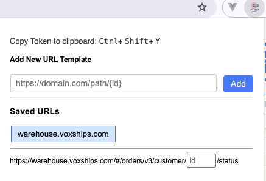

# St Utils

Browser Extension to boost productivity while working with internal tools like **Warehouse**, **VoxMG (frontend and backend)**, etc.

## 🚀 Features

### 1. Copy Token to Clipboard
**Method**: Press `Ctrl + Shift + Y`(`cmd + Shift +y` For MAC)
*(You can change this shortcut from Chrome’s Extension Keyboard Shortcuts settings.)*

**Description**:
Instantly copies the `apiToken` to your clipboard when browsing domains:

- `https://warehouse.voxships.com/*`
- `https://demo.voxmg.com/*`
- `https://demo.shikhartech.com/*`
- `https://demodev.shikhartech.com/*`

Useful for API testing, debugging, and other dev utilities.

---

### 2. Route Go-To Function
**Method**: Use the extension popup menu

**Description**:
Tired of copying and editing long URLs just to visit specific resource pages like order details?

Set a dynamic URL pattern like:

https://test.com/order/{orderId}/details

Then, simply input the `orderId`, and press **Enter** to navigate directly to the desired page.

---

## 🧩 Installation

1. Open **Google Chrome**.
2. Visit: `chrome://extensions/`
3. Enable **Developer mode** (toggle on top right).
4. Click **"Load unpacked"**.
5. Select the root folder of this repo (where the `manifest.json` file is located).
6. Done! Your extension should now appear in the Chrome toolbar.

---

## 🛠️ Dev Notes

- This is a lightweight extension built for internal use.
- Works best with Chrome-based browsers.

---

## 📬 Contributions

Pull requests and suggestions are welcome. Let's make dev life smoother 🚀